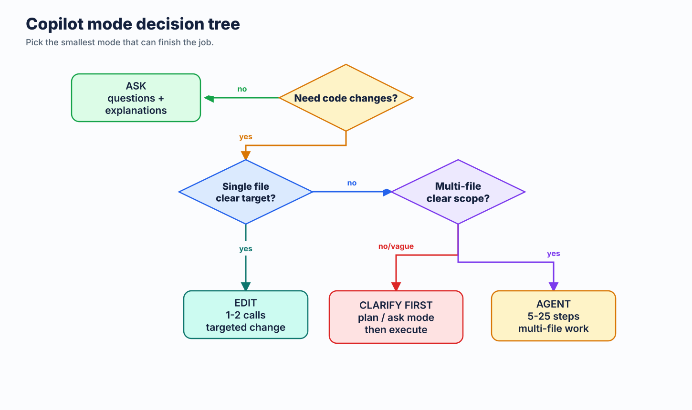
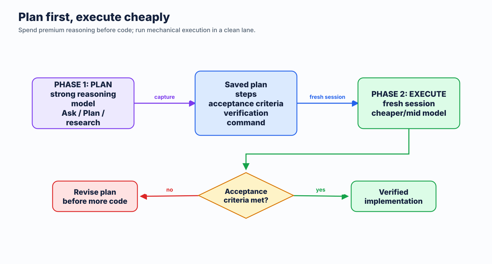
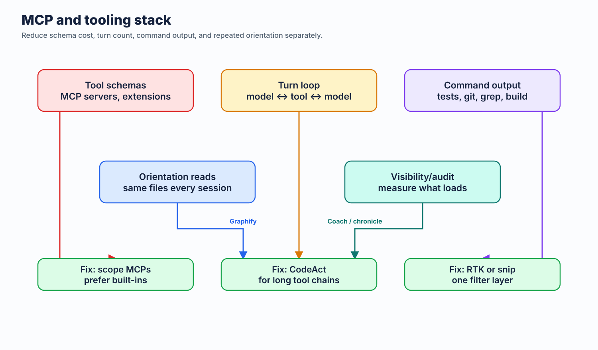

# 2.5 Workflow-Specific Optimization

[← Back to Guide](index.md)

---

## 2.5.1 Commit Messages

Conventional Commits format. Subject ≤50 chars. Body only when "why" isn't obvious.

**Verbose commit (~25 tokens):**

```text
feat: Added a new feature to allow users to reset their passwords through
the settings page, which also sends a confirmation email
```

**Terse commit (~10 tokens):**

```text
feat: add password reset via settings page

Sends confirmation email on reset.
```

Savings seem small per-commit, but the Coding Agent reads git history for context. Terse commits across a repo's history compound.

## 2.5.2 PR Reviews

Instead of paragraph-long review comments, use one-line format:

**Verbose review comment (~40 tokens):**

```text
I noticed that on line 42, the user variable could potentially be null at this
point in the code, which would cause a NullPointerException when you try to
access the user's email property. You should add a null check before accessing
this property to handle this edge case properly.
```

**Terse review (~12 tokens):**

```text
L42: 🔴 bug: user can be null here. Add null guard before .email access.
```

**Savings: ~70%.** Same information. Same actionability. Fraction of the tokens.

Severity prefixes encode priority in 1-2 tokens:

- 🔴 Bug / security issue — must fix
- 🟡 Suggestion — should fix
- 🔵 Nit — optional improvement
- ❓ Question — needs clarification

## 2.5.3 Ask Mode vs. Agent Mode

This is one of the higher-leverage savings opportunities in the guide.

**Agent Mode** can trigger 3-10 internal model calls per visible action. It reads files, plans, executes, verifies. Each step costs tokens.

**Ask Mode** is a single call. One question, one answer.



| Task | Right Mode | Why |
|------|-----------|-----|
| "What does this function do?" | Ask | Single-shot answer. No tool use needed |
| "What's the TypeScript syntax for generics?" | Ask | Knowledge question |
| "Refactor this module to use dependency injection" | Agent | Multi-file changes, needs to read/write code |
| "Create a REST API with tests and docs" | Agent | Multi-step creation task |
| "Why is this test failing?" | Ask (usually) | Often needs just the error + context you provide |

**Savings: 60-90% per simple question** by using Ask instead of Agent.

### Advanced Copilot CLI tactic: CodeAct

There is one useful exception for **tool-heavy Copilot CLI sessions**. [`copilot-codeact-plugin`](https://github.com/jsturtevant/copilot-codeact-plugin) is an optional external plugin that changes the execution shape: instead of model -> tool -> model -> tool across many turns, the agent writes one Python program that chains the work together and runs it in one sandboxed execution.

Why this can save tokens:

- Fewer turns means less replay of system prompt, prior messages, and built-in tool definitions.
- If MCP servers are loaded, their tool catalogs are replayed fewer times too, so savings can compound.
- One consolidated result is often shorter than narrating every intermediate `grep` / `view` / `bash` hop.

When to use it:

- CLI-heavy exploration or audit tasks that would otherwise bounce through many small tool calls
- MCP-loaded sessions where schema replay is already expensive
- Repeatable analysis tasks such as TODO sweeps, function indexes, coverage checks, or cross-reference gathering

When not to use it:

- Simple one-shot Ask questions
- Normal IDE chat/edit workflows where the plugin does not apply
- Teams that do not want an external plugin in the workflow

Keep the claim bounded: this guide is **not** benchmarking CodeAct itself. The plugin README reports lower token use on its own benchmark prompts, including MCP-loaded cases, but that is plugin-reported task data, not a universal savings baseline.

### Complementary: RTK or snip for tool output compression

CodeAct reduces the *number* of tool calls. [**RTK (Rust Token Killer)**](https://github.com/rtk-ai/rtk) and [`snip`](https://github.com/edouard-claude/snip) reduce the *size* of each shell tool result. They address different sides of the same problem and can be used together.

These tools intercept `git`, test runners, `grep`, `ls`, and other dev commands and compress their output before it reaches the agent — often 60–90% savings on verbose command output. Unlike CodeAct, this is not about Copilot CLI only; it can help anywhere the shell hook is reliable. Treat Windows and preview hook paths as pilots, not default rollouts. See [MCP & Tool Costs §2.7.7](08-mcp-tool-costs.md#277-compress-tool-output-at-the-source-rtk) and [§2.7.8](08-mcp-tool-costs.md#278-rtk-alternative-snip) for setup.

## 2.5.4 Default to Auto Model Selection

The model picker is one of the highest-cost control surfaces in Copilot. Pinning a high-effort model "just in case" applies that model's per-token rate to every interaction in the session — including the trivial ones.

**The right default is Auto.** Per GitHub's official docs, Auto chooses from the supported Auto-selection pool based on real-time system health and model performance, and on paid plans it bills at a discounted rate compared to manually pinning the same model. Treat it as the best default baseline, not as automatic escalation to every premium model. Higher-cost models still need to be pinned deliberately. Override only when you know better:

- Pin to a cheap/fast model when you *know* the task is trivial (autocomplete-style, syntax lookup, one-line edit).
- Pin to a high-effort model when you *know* the task needs deep reasoning (architecture, security review, novel decomposition).
- Otherwise, **let Auto choose.** It captures the cheap/default path automatically without making you micromanage the picker. If you want a higher-cost premium model, pin it explicitly. See [Model Selection & Pricing](11-models-and-pricing.md).

Teams that switch their default from "always Sonnet" or "always Opus" to "Auto, override when needed" generally reduce spend because they stop defaulting every interaction into the higher-cost lane.

### Cache-aware model workflow

Model routing and caching must work together. In long expensive sessions, avoid changing your cost/control surface mid-thread:

- do not switch model unless the task clearly changes
- do not toggle MCP servers unless the task truly requires different tools
- do not switch agent/profile mode in the same long thread

Why: those controls live in the high, stable prefix of context. Changing them can invalidate cached prefixes and force reprocessing of large input blocks.

Practical pattern:

1. Pick lane at session start: `{model, agent/profile, MCP set}`.
2. Keep lane stable while working that thread.
3. If lane must change, start a fresh chat with a concise handoff summary.

## 2.5.5 Retune Prompts to the Target Model

This is not prompt compression. It may not reduce tokens per request. It reduces total token use by improving first-pass quality, which cuts follow-up turns, repeated clarifications, and agent rework.

Model providers publish prompting guides that change with model versions. Treat model upgrades like dependency upgrades: read the migration/prompt guide, then adapt your prompts and instruction files for that model's current behavior.

**Workflow:**

```text
Open official prompting guide for target model.
Paste URL into Copilot chat.
Ask: "Adapt these target files to this guide. Keep behavior same. Reduce rework."
Target files: .github/copilot-instructions.md, .github/instructions/*.instructions.md, agents/*.md, app prompt files.
Review diff. Keep only measurable, model-relevant changes.
```

Official starting points:

| Provider | Model family | Prompting guide |
|---|---|---|
| Anthropic | Claude Sonnet / Opus / Haiku | [Prompt engineering overview](https://platform.claude.com/docs/en/build-with-claude/prompt-engineering/overview) and [Claude latest-model best practices](https://platform.claude.com/docs/en/docs/build-with-claude/prompt-engineering/claude-4-best-practices) |
| OpenAI | GPT-5.5 / GPT-5 | [GPT-5.5 prompting guide](https://developers.openai.com/api/docs/guides/prompt-guidance) and [GPT-5 prompting guide](https://cookbook.openai.com/examples/gpt-5/gpt-5_prompting_guide) |
| Google | Gemini | [Gemini prompt design strategies](https://ai.google.dev/gemini-api/docs/prompting-strategies) |

### Example: one base instruction, tuned three ways

Base instruction:

```markdown
You are a coding assistant. Help with implementation. Be concise. Ask questions if needed. Follow repo style. Run tests.
```

Model-specific rewrites:

| Target model | Tuned instruction | Why it fits |
|---|---|---|
| **Claude Sonnet** | `Role: senior repo engineer.\nUse XML-ish sections when helpful: <task>, <constraints>, <done>.\nBefore edits: inspect relevant files only. Preserve existing style.\nFor ambiguous requests: ask only if choice changes implementation.\nDone = patch applied + existing targeted tests pass or blocker named.` | Claude guides emphasize clear success criteria, examples/structure, explicit tool/use boundaries, and calibrated effort. XML-style delimiters often help separate task, context, and constraints. |
| **GPT-5.5** | `Outcome: correct repo change with minimal churn.\nSuccess: target behavior works, diff scoped, tests or exact blocker reported.\nChoose efficient path; do not over-spec process.\nStart tool-heavy work with one short progress update.\nAsk only for missing info that changes outcome or safety.` | GPT-5.5 guidance favors outcome-oriented prompts, concise personality/collaboration rules, efficient solution paths, visible preambles for multi-step work, and avoiding legacy over-specification. |
| **Gemini** | `Task: implement requested repo change.\nContext: use referenced files, nearby tests, and repo conventions.\nConstraints: concise output, scoped diff, no unrelated rewrites.\nFormat final: changed files + behavior impact + test result/blocker.\nIf input is incomplete, state one needed detail.` | Gemini guidance stresses clear task/input/constraints/response-format structure. Explicit format and context boundaries reduce interpretive drift. |

### Example user prompt for Copilot

```text
Target model: GPT-5.5.
Guide: https://developers.openai.com/api/docs/guides/prompt-guidance
Files: .github/copilot-instructions.md, agents/token-saver.agent.md
Adapt prompts to guide. Preserve behavior. Cut repeated clarification. Keep concise.
Show diff only.
```

Use this when:

- You upgrade or change default model.
- A prompt worked on one model but becomes verbose, lazy, over-eager, or too literal on another.
- Agent keeps making the same wrong assumption after a model change.
- You maintain app prompts, agent profiles, or reusable instruction files.

Avoid this when prompt behavior is already measured and stable. Changing instructions without a failure signal can add noise.

## 2.5.6 When NOT to Compress

Compression has limits. Some situations demand full clarity:

- **Security warnings** — "This will delete all user data" must not be abbreviated to "del usr data"
- **Irreversible operations** — Confirmation prompts must be unambiguous
- **Onboarding contexts** — New team members need the "why", not just the "what"
- **Complex multi-step instructions** — When fragment order could cause misreading
- **Regulatory/compliance text** — Legal requirements demand precision

A well-designed terse prompt template or agent profile can handle this automatically — dropping terse mode for security warnings and irreversible action confirmations, then resuming after that section.

## 2.5.7 Close the Loop with `/chronicle`

Token waste isn't only in any one prompt — it's in the **patterns** you don't notice. The same misread intent costing 5K extra tokens per session, every session. Copilot ships a built-in feedback loop for this: the [`/chronicle`](https://docs.github.com/en/copilot/concepts/agents/copilot-cli/chronicle) slash command analyzes your local session history and tells you where Copilot got confused, where you went in circles, and how to fix it.

> **Scope:** `/chronicle` is a **Copilot CLI** feature, backed by local session history in `~/.copilot/session-state/`. It runs in Copilot CLI interactive sessions — and inside **JetBrains IDEs** via interactive Copilot CLI sessions. It is **not** available in **VS Code**; for VS Code usage analytics, see [AI Engineering Coach](#258-vs-code-usage-analytics-ai-engineering-coach) below.
>
> **Availability:** `/chronicle` is currently experimental. Enable it with `/experimental on` in an interactive Copilot CLI session, or pass `--experimental` on the command line.

The full subcommand set is `standup`, `tips`, `cost tips`, `search`, `improve`, and `reindex`. The three with the most token-saving impact:

| Command | What it does | Token-saving payoff |
|---------|--------------|---------------------|
| **`/chronicle cost tips`** | Analyzes your token spend across recent sessions — prompt length, tool-call frequency, continuation steps — and suggests concrete ways to cut cost | Highest, and the most on-topic for this guide. Targets token spend directly. |
| **`/chronicle improve`** | Scans session history for back-and-forth, misunderstood intent, and repeated corrections — then **generates custom-instruction snippets** to prevent the pattern next time | High. Cuts off recurring waste at the source. Each fix compounds across every future session in that repo. |
| **`/chronicle tips`** | Personalized coaching based on how you actually use Copilot — surfaces features and workflow improvements you're missing | Medium. Often suggests Ask Mode, model routing, or context scoping changes worth real tokens. |
| **`/chronicle standup`** | Generates a standup summary from your session data (branches, PRs, status) | Indirect — saves the 10 minutes you'd spend reconstructing yesterday, not direct token spend. |

### The `cost tips` workflow

The most direct fit for this guide. Run it weekly to see where your tokens actually go.

```text
/chronicle cost tips
```

Copilot CLI analyzes your token usage across recent sessions — looking at patterns like prompt length, tool-call frequency, and continuation steps — and surfaces specific, usage-grounded ways to reduce spend. Unlike generic advice, these recommendations are tied to your real session data, so they tend to point at the few habits costing you the most.

### The `improve` workflow

This is the one that generates lasting fixes. Run it weekly, or any time you catch yourself thinking *"why does it keep getting this wrong?"*

```text
/chronicle improve
```

Copilot CLI reads your recent CLI sessions, identifies recurring confusion (e.g., it kept assuming the wrong test framework, or kept asking which directory contains the API code), and proposes additions to your custom instructions. Review the suggestions — accept the ones that match real project-specific cautions, skip the ones that are just LLM-generated boilerplate (see [Part 7: The AGENTS.md Problem](07-agents-md-problem.md) for why pruning matters).

**Why this fits a token-optimization guide:** every back-and-forth turn is full input tokens (your follow-up + accumulated history) **plus** full output tokens (the corrected response). A single misread intent that costs three extra turns is easily 10K-30K tokens. Catching one pattern with `/chronicle improve` → one or two lines added to `copilot-instructions.md` → that pattern stops adding repeat token cost.

### The `tips` workflow

Run every week or two:

```text
/chronicle tips
```

Treat the suggestions like a code review — not all are worth adopting, but the ones that match your actual workflow are usually high-ROI. Common tips that overlap with this guide: switching to Ask Mode for explanation requests, scoping instruction files with `applyTo`, disabling unused MCP servers.

### Where this fits in the workflow

- **Weekly:** `/chronicle cost tips` — see where tokens go, and `/chronicle tips` — catch missed habits.
- **When something feels repetitive:** `/chronicle improve` — turn the friction into a one-time fix.
- **Daily standup (optional):** `/chronicle standup last 24 hours` — for the human ritual, not for tokens.

All session data lives locally in `~/.copilot/session-state/` and on your machine only. This is **Copilot CLI session data**, not a general Copilot Chat history store. Standard model interactions still apply when you run a `/chronicle` command (the data is sent to the model to generate the summary), but nothing is uploaded for storage.

## 2.5.8 VS Code Usage Analytics: AI Engineering Coach

[`/chronicle`](#257-close-the-loop-with-chronicle) covers Copilot CLI sessions. For VS Code usage, [**AI Engineering Coach**](https://github.com/microsoft/AI-Engineering-Coach) is the counterpart — a local VS Code extension that reads your VS Code AI session logs and surfaces the same class of insight: anti-patterns, token patterns, context health, and skill discovery.

> **Privacy:** All analysis runs locally. No data leaves your machine. The extension is read-only — it never modifies your session files. Optional AI features (rule compiler, context review) use the VS Code built-in Copilot model API only when you explicitly invoke them.

Key capabilities relevant to token efficiency:

| Feature | What it surfaces |
|---------|-----------------|
| **Anti-Patterns** | 45 editable rules across prompt quality, session hygiene, code review, tool mastery, and context management — with severity ratings and concrete fix actions |
| **Context Health** | Agentic readiness checklist, workspace context map, and instruction-file audit |
| **Skill Finder** | Detects repeated prompt patterns in your history and matches them to reusable skills from the open-source catalog |
| **Output / Burndown** | AI-generated code volume by language and model; token budget progress with projections |

**Quick start:**

```bash
git clone https://github.com/microsoft/ai-engineering-coach.git
cd ai-engineering-coach
npm install && npm run package
code --install-extension ai-engineer-coach-*.vsix
```

Then `Cmd+Shift+P` → **AI Engineer Coach: Open Dashboard**.

**How it complements `/chronicle`:** `/chronicle` acts on CLI session history to generate instruction fixes. AI Engineering Coach acts on VS Code session history to score your practice and flag structural issues (context bloat, unused MCPs, instruction-file gaps). Use both: chronicle to patch recurring prompt failures; AI Engineering Coach to audit the broader VS Code setup and track trend lines.

## 2.5.9 Plan First, Then Execute (and Route the Phases)

The most expensive tokens are the ones spent reaching a *wrong* outcome: an agent that codes for twenty steps in the wrong direction, then gets unwound and redone. Separating **planning** from **execution** is one of the highest-leverage habits for cutting that waste.

**The two-phase pattern:**



1. **Plan in plan mode (or Ask mode) first.** Use Copilot CLI's plan mode (or VS Code Ask mode) to think through the approach *before* any code is written — files to touch, order of changes, edge cases, acceptance criteria. Planning is cheap: it's mostly reasoning, no large diffs, no repeated tool loops. This is where a stronger model earns its cost, because a good plan prevents expensive rework downstream.
2. **Save the plan, then execute it.** Write the agreed plan to a file (e.g. `plan.md`) or a tracked issue, then start a **fresh session** and prompt the execution against that saved plan. A clean session keeps the cacheable prefix stable (see [Caching §2.3.5](04-context-management.md#235-caching-store-and-reuse-context-within-prompts)) and avoids dragging the whole planning conversation forward as input tokens on every execution turn.

**Why this saves tokens:**

- **Fewer wasted steps.** A concrete, pre-agreed plan means the agent doesn't explore, guess requirements, or backtrack. Each avoided agent step is one full context reload saved (see [Minimizing Agent Steps §4.5.3](10-practical-setup.md#453-minimizing-agent-steps)).
- **Cheaper execution lane.** Once the hard thinking is done and captured as explicit steps, execution is often mechanical — a cheaper model (Auto or an included model) can carry it out. Reserve the premium model for the planning phase where reasoning quality moves the outcome. See [Model Routing §4.5](10-practical-setup.md#step-5-mix-models-by-task-model-routing).
- **A clean execution context.** Starting execution from a saved plan, rather than a long plan-then-build mega-session, keeps history short and the prefix cache-friendly — input cost per turn stays low.

**Rule of thumb:** plan with the strong model, execute with the cheap one, and put the plan on disk in between. The outcome is reached in fewer total tokens *and* is usually higher quality, because the plan was reviewed before a single line was written.

For the fuller outcome-per-token frame, skill taxonomy, benchmark caveats, and current model routing matrix, see [Outcome per Token](13-outcome-per-token.md).

## 2.5.10 Layer Tooling on Top of the Copilot Harness

Copilot CLI and VS Code Copilot already optimize parts of the agent loop. Treat that as the baseline before adding external tools:



- **Prompt/cache layer:** keep `{model, active MCP set, active agent/profile}` stable so cached prefixes stay reusable.
- **Tool-schema layer:** prefer built-in tools and scoped MCPs; Copilot can defer or route some tool definitions, but extra servers and extensions still add surface area.
- **Transport/session layer:** WebSocket reuse and automatic compaction help long agent runs, but compaction summarizes what the agent already saw.
- **Terminal-output layer:** built-in truncation is a safety net, not a semantic filter.

Add third-party tools only for the layer they actually improve:

| Layer | Tooling | What it reduces |
|-------|---------|-----------------|
| Workflow turns | CodeAct | Repeated replay from many small tool calls in Copilot CLI |
| Command output | RTK or snip | Verbose `git`, test, grep, build, and infra command output |
| Command choice | minimal-context-tools | Broad file reads and iterative searching by steering toward `rg`, `fd`, `jq`, `ast-grep` |
| Codebase orientation | Graphify | Repeated structural file reads across sessions |
| Visibility/audit | [Tokentop](https://github.com/tokentopapp/tokentop), Tokalator, token-optimizer | Tokentop gives live local session, model, token, cost, and burn-rate visibility; monitoring does not compress by itself |

**Rule:** one tool per layer. Combining CodeAct with RTK or snip can make sense because one reduces turn count and the other reduces output size. Running RTK and snip on the same command path usually does not — it can double-truncate output and make failures harder to inspect.

Use this order when tuning a session:

1. Pick the Copilot lane once: model, mode, active MCP/tool set, and agent/profile.
2. Disable unused MCP servers and extension-provided tools.
3. Use skills or focused agent instructions to make tool calls precise.
4. Add one shell-output filter if command output is still large.
5. Start a fresh session when changing lanes instead of mutating a long thread.

---

**Next:** [The AGENTS.md Problem →](07-agents-md-problem.md)
