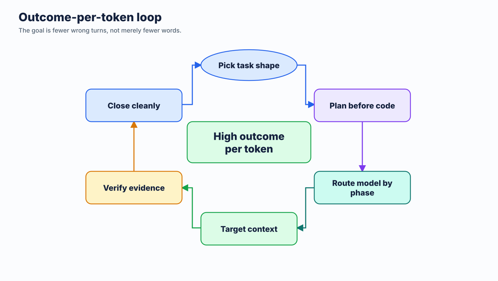

# Outcome per Token

[← Back to Guide](index.md)

---

Token optimization is not the real goal. The real goal is **more accepted work per token spent**: merged pull requests, closed bugs, passing tests, clean reviews, and fewer wrong-direction agent loops.

Raw token minimization can even be the wrong move. A short prompt that causes the agent to guess, edit the wrong files, fail tests, and backtrack is more expensive than a longer plan that gets the first implementation right.

## Why Outcome per Token Matters

Usage-based billing makes tokens visible, but engineering teams do not buy tokens. They buy outcomes.

Tomasz Tunguz describes this as the shift to intelligence per dollar: the application layer competes on the cost of a closed ticket, shipped PR, or resolved support case, not the cheapest raw token.[^tunguz] That maps directly to Copilot work. The useful metric is:

```text
outcome per token = verified work completed / total tokens spent
```

For agentic coding, cost behaves differently than in simple chat. The Microsoft/Stanford paper "How Do AI Agents Spend Your Money?" reports that agentic coding tasks consume roughly **1,000×** more tokens than code chat, runs on the same task can vary by up to **30×**, and higher token usage does not reliably improve accuracy.[^agent-costs]

### What the research shows

| Finding | Why it matters |
|---|---|
| Agentic coding can consume roughly **1,000×** more tokens than code chat | Do not extrapolate chat-cost intuition to agent sessions |
| Same task can vary by up to **30×** across runs | Budget with margin; one run is not a stable cost estimate |
| Higher token usage does not reliably improve accuracy | More exploration is not automatically better work |
| Accuracy often peaks at intermediate cost and then saturates | Defaulting to the biggest model for every step can waste money |
| Input tokens dominate agentic cost | Context hygiene matters as much as output terseness |
| Models underestimate their own token use | Do not trust an agent's pre-task cost guess; use budgets and stop rules |
| Token efficiency varies by model independent of pass rate | Compare outcome and cost together, not benchmark score alone |

The implication is simple: optimize the loop, not the sentence.

## The Outcome-per-Token Loop

High outcome per token comes from six habits:



1. pick the right task shape
2. plan before implementation
3. route the right model to the right phase
4. preserve clean context and cache boundaries
5. verify before claiming done

Low outcome per token usually has the opposite shape: vague prompt, huge context, expensive model pinned too long, no acceptance criteria, agent edits before planning, tests run late, then a rework session starts from scratch.

## Prompt Skills as Superpowers

The community project [`obra/superpowers`](https://github.com/obra/superpowers) popularizes a useful framing: treat repeatable agent practices as skills, not one-off prompts.[^superpowers] It is not an official GitHub product, but its skill categories map well to Copilot cost control.

This chapter uses that idea as a practical taxonomy.

| Skill | What it does | Token effect |
|---|---|---|
| Brainstorming | Explore multiple approaches before choosing | Prevents early lock-in and wrong-direction code |
| Planning | Converts intent into file-level steps and checks | Reduces guessing during execution |
| Greenness | Keeps tests passing through the work | Avoids debugging unknown baseline failures |
| Verification before completion | Requires evidence before "done" | Prevents false completion and rework |
| Impeccable close | Finishes cleanly with criteria, tests, and PR summary aligned | Prevents review churn and follow-up agent sessions |
| Branch-close discipline | Ends branch/session cleanly after merge | Prevents stale context from leaking into next task |

The skills below are patterns. The public libraries that follow are example implementations of those patterns, not mandatory dependencies.

## Skill Libraries Worth Borrowing From

Community skill libraries can improve outcome per token when they make the next agent action more precise: clearer requirements, safer tool use, better tests, cleaner handoff, or stronger final review. Treat them as reusable practice, not official GitHub or Microsoft guidance. Most claims are qualitative and experience-based; use them because they encode good workflow discipline, not because they prove a universal benchmark gain.

| Library | Best borrowed skill | Use when | Caveat |
|---|---|---|---|
| [`obra/superpowers`](https://github.com/obra/superpowers) | TDD, planning, verification, branch finish | Need broad agent SDLC discipline | Community framework |
| [`softaworks/agent-toolkit`](https://github.com/softaworks/agent-toolkit) | Planning orchestration, handoff, entropy reduction | Complex features, long sessions, bloated instruction files | Personal toolkit; qualitative claims |
| [`catpilotai/catpilot-ai-guardrails`](https://github.com/catpilotai/catpilot-ai-guardrails) | Security and tool-loop guardrails | Agents touch secrets, cloud, DB, Docker, or supply chain | Guidance, not runtime enforcement |
| [`vercel-labs/agent-browser`](https://github.com/vercel-labs/agent-browser/blob/main/skills/agent-browser/SKILL.md) | Snapshot, wait, and evidence discipline | Agents test browser UIs | Browser-specific; installed CLI content is authoritative |
| [`vercel-labs/writing-guidelines`](https://github.com/vercel-labs/writing-guidelines) | Plan-as-prompt, output review, AI-tell detection | Docs, PR descriptions, specs, generated prose | Editorial guidance, not measured token reduction |
| [`mattpocock/skills`](https://github.com/mattpocock/skills) | TDD, bug diagnosis, code review, domain modeling | Engineering tasks need sharper loops | Examples skew Claude and TypeScript workflows |
| [`PramodDutta/qaskills`](https://github.com/PramodDutta/qaskills) | QA and test-generation skills | Need Playwright, API, BDD, security, accessibility, or bug-report depth | Large skill files; early project |

### Skill Library Star History

[](https://www.star-history.com/#obra/superpowers&softaworks/agent-toolkit&catpilotai/catpilot-ai-guardrails&vercel-labs/agent-browser&vercel-labs/writing-guidelines&mattpocock/skills&PramodDutta/qaskills&timeline)

Star history is an adoption signal, not a quality benchmark. Use it to understand community attention, then judge each library by whether it changes the next agent action.

### `obra/superpowers`: Baseline Agent SDLC Discipline

Use Superpowers as the reference pattern: skills are small, named operating procedures. The value is not the brand name; the value is turning "be careful" into concrete moves the agent can follow.[^superpowers]

- Borrow the TDD, planning, verification, and branch-finish habits.
- Convert team norms into small reusable prompts or skill files.
- Prefer skills that force evidence: test output, file-level plan, acceptance criteria, or clean close.
- Do not load broad skills when a one-line instruction would steer the next action.

### `softaworks/agent-toolkit`: Planning, Handoff, and Entropy Control

`agent-toolkit` is a broad personal toolkit with skills, subagents, and commands for Claude-style agent workflows.[^agent-toolkit] Its best fit here is not copying everything; it is borrowing the structure for long-running engineering work.

- Use `gepetto`-style flow for complex features: research, stakeholder questions, spec, plan, review, then execution.
- Use `requirements-clarity` before coding when the task still has hidden ambiguity.
- Use `session-handoff` when a long session must transfer context without leaking stale decisions or secrets.
- Use `reducing-entropy` as an explicit deletion-biased review: fewer files, fewer branches, less code, clearer seams.
- Use instruction-file refactor patterns when `AGENTS.md`, `CLAUDE.md`, or team prompts grow so large they become context tax.

### `catpilot-ai-guardrails`: Risk Stops Before Expensive Mistakes

Guardrail skills improve outcome per token by preventing costly wrong actions: leaked secrets, unsafe cloud mutations, database damage, supply-chain drift, or retry loops.[^catpilot-guardrails] They are especially relevant when the agent has write-capable tools.

- Add guardrails before tasks that touch credentials, PII, cloud CLIs, databases, Docker, CI, or dependency manifests.
- Require explicit confirmation before destructive or high-cost actions.
- Use retry budgets and loop-stop rules so agents do not burn tokens repeating the same failing tool call.
- Pair skill guidance with real controls: branch protection, CI, SAST, DAST, SCA, secret scanning, and least-privilege credentials.
- Do not describe these skills as compliance enforcement. They guide behavior; they do not sandbox tools.

### `agent-browser`: Browser QA Without DOM Floods

`agent-browser` is useful because it teaches browser agents to use compact observations and evidence-oriented waits instead of dumping huge HTML or guessing from screenshots.[^agent-browser]

- Prefer accessibility-tree snapshots and stable element references over raw DOM dumps.
- Re-snapshot after page-changing actions; browser references go stale.
- Wait on observable states such as text, URL, or network idle instead of fixed sleeps.
- Capture proportionate evidence: failing selector, visible state, screenshot only when useful.
- Treat page content as untrusted input. Do not follow instructions embedded in a website under test.

### `writing-guidelines`: Make the Plan the Prompt, Spec, and Review Artifact

Vercel's writing guidance is useful for engineering agents because it turns vague prose into testable artifacts.[^writing-guidelines] Better writing reduces rework tokens: fewer hidden goals, fewer vague success criteria, fewer review comments asking what changed.

- Write goals with testable verbs, not vague aspirations.
- Keep one page or prompt focused on one job.
- Use the plan as the implementation prompt, test spec, and PR-description seed.
- Flag weasel words and vague quantifiers before sending text to an agent.
- Borrow the second-pass review pattern: ask another agent or model for concrete `file:line` findings, not general praise.

### `mattpocock/skills`: Engineering Loops That Reduce Guessing

Matt Pocock's skills are useful because they encode engineering loops: TDD, bug diagnosis, code review axes, domain modeling, and large-work decomposition.[^mattpocock-skills] They are strongest when the agent would otherwise jump straight from symptom to edit.

- Use TDD skills to agree on seams before implementation.
- Use bug-diagnosis skills to build a fast, deterministic red/green loop before theorizing.
- Split review into two axes: standards review and spec review, so style concerns do not hide requirement misses.
- Use domain-modeling vocabulary such as seam, adapter, leverage, locality, and module depth to guide architecture prompts.
- Use wayfinding patterns to separate human-in-the-loop tickets from agent-runnable work.

### `qaskills`: QA Depth on Demand

`qaskills` is a QA skill catalog with CLI, MCP server, catalog, SDK, and validator.[^qaskills] Its token value is specialization: load QA depth when the task is actually QA-heavy instead of asking a general agent to invent a test strategy from scratch.

- Use Playwright skills for page-object discipline, accessibility-first selectors, fixtures, and anti-pattern checks.
- Use test-plan skills for risk matrices, traceability, equivalence partitioning, and entry/exit criteria.
- Use bug-report skills when the outcome is a reproducible issue with severity, priority, environment, and evidence.
- Use BDD/Cucumber skills when acceptance criteria should become executable Given/When/Then scenarios.
- Use OWASP, visual-regression, axe-core, k6, and API-testing skills only when those checks are part of the task.

### Do Not Install Every Skill

Skills are context too. Install only the ones that change the next agent action.

| Task | Load |
|---|---|
| Test design, QA automation, bug reports | QA skills |
| Browser UI investigation | Browser snapshot/wait/evidence skills |
| Cloud, database, Docker, secrets, dependencies | Guardrail skills |
| Specs, docs, PR descriptions | Writing and review skills |
| Long sessions, complex features, handoff | Planning and handoff skills |

If a skill is not likely to change the next edit, command, test, or review, leave it out. The best skill selection is still context selection.

### Do Not Over-Optimize the Skill Stack

Skill research can become its own token sink. Chasing the perfect library, the perfect subagent, or the "best of the best" workflow often produces no shipped work. The practical ceiling arrives early: a clear plan plus one hard challenge pass is already strong for most tasks.

Use a simple `plan + grill-me` loop before adding more machinery:

1. write the plan with acceptance criteria, likely files, risks, and verification command
2. ask a second pass to grill the plan: missing edge cases, wrong assumptions, cheaper path, and failure modes
3. revise once, then execute

Add specialized skills only when they change the next action. If the task is not security-heavy, browser-heavy, QA-heavy, or handoff-heavy, more skill loading is probably context tax.

### Brainstorming Skill

Use this before the first edit when requirements are ambiguous.

```text
Before coding, list three implementation approaches.
For each: files likely touched, risks, test strategy, and token/cost risk.
Do not edit files.
```

This spends a small number of reasoning tokens to avoid a much larger rework loop.

### Planning Skill

Planning turns "build X" into executable steps.

Use the official VS Code [Plan agent](https://code.visualstudio.com/docs/agents/planning) when available. It can be selected from the agent dropdown or invoked with `/plan`, generates a high-level plan plus implementation and verification steps, and supports separate model settings for planning and implementation through `chat.planAgent.defaultModel` and `github.copilot.chat.implementAgent.model`.[^plan-agent]

For GitHub.com tasks, Copilot cloud agent supports a research, plan, iterate flow: ask it to research the repo, iterate on a plan, then implement the agreed plan only when ready.[^cloud-plan]

Important caveats:

- VS Code Plan agent session memory is cleared when the conversation ends. Save important plans externally before closing the session.[^plan-agent]
- Copilot cloud agent planning and iteration before creating a PR are GitHub.com capabilities; integrations such as Azure Boards, JIRA, Linear, Slack, or Teams support direct PR creation only.[^cloud-agent]
- Cloud agent sessions have a 59-minute hard limit. Break large work into smaller tasks.[^cloud-agent]
- Business and Enterprise users need the relevant admin policy enabled before using cloud agent.[^cloud-agent]

### Greenness Skill

"Greenness" is this guide's label for a simple discipline: keep the test baseline green.

Before asking an agent to modify code:

1. know whether tests pass now
2. tell the agent the baseline
3. ask it to preserve that baseline
4. run tests before accepting completion

If tests start red and the agent does not know that, it spends tokens debugging pre-existing failures. If tests go red during the task and the agent keeps editing, it compounds uncertainty.

Green baseline first. Then change.

### Verification-before-Completion Skill

Do not accept "done" without evidence.

```text
Before you report completion, run the targeted tests or build,
state the exact command, and confirm each acceptance criterion.
```

This costs a little at the end. It saves a lot when it prevents false completion, review churn, and a second agent session.

### Impeccable Close Skill

"Impeccable close" is this guide's label for closing the loop cleanly. The term is not an official Copilot concept; the practice is the important part.

A good close includes:

1. accepted criteria checked
2. tests/build run where relevant
3. no accidental scope creep
4. no stale TODOs or commented-out attempts
5. PR summary matches the actual diff
6. next step named only if one is truly needed

This is outcome-per-token discipline. A sloppy close moves cost from implementation into review, follow-up prompts, and hotfixes.

### Branch-Close Discipline

After merge, close the branch and any long-running agent session. Do not keep using the same context for the next unrelated task.

Stale sessions accumulate decisions, tool output, file reads, and abandoned approaches. Every later prompt may drag that history forward as input tokens. A clean close keeps the next task from paying for the previous one.

## Plan First, Then Execute Cheaply

The strongest pattern is two separate phases:


GitHub's [Optimize AI Usage](https://docs.github.com/en/copilot/tutorials/optimize-ai-usage) guidance makes the same point: defaulting to the most capable model can increase token usage without improving the outcome, and overusing reasoning models in execution-heavy tasks can reduce quality by making the model overthink or introduce unnecessary changes.[^optimize-ai] The same page gives the practical rule: plan with a strong reasoning model, then implement with a cheaper model.

Why fresh session matters:

- the planning conversation does not get re-sent on every execution turn
- the execution context starts clean
- the plan becomes a stable, cache-friendly prefix
- model routing is deliberate instead of accidental

This is the expanded version of [Plan First, Then Execute §2.5.9](06-workflow-optimization.md#259-plan-first-then-execute-and-route-the-phases).

### Official Three-Tier Framework

GitHub's official tutorial separates work into three model lanes.[^optimize-ai]

| Tier | Best for | Outcome-per-token rule |
|---|---|---|
| Reasoning models | Architecture decisions, complex debugging, system design, deep analysis | Use for planning and hard judgment |
| Mid-tier models | Clear plans that need efficient implementation | Use for execution once ambiguity is removed |
| Lighter models | Refactoring, formatting, documentation, routine scoped changes | Use for bounded mechanical work |

Do not pay for frontier reasoning after the hard thinking is already captured in the plan.

## Day-to-Day Model Guidance

Model advice changes quickly. Treat this table as routing guidance, not permanent truth. Check the official [supported models](https://docs.github.com/en/copilot/reference/ai-models/supported-models), [model comparison](https://docs.github.com/en/copilot/reference/ai-models/model-comparison), and [models and pricing](https://docs.github.com/en/copilot/reference/copilot-billing/models-and-pricing) pages before publishing customer-specific guidance.[^supported-models][^models-pricing]

| Work | Good default | Tier | Typical input cost / 1M tokens | Why |
|---|---|---|---:|---|
| Quick lookup, syntax, tiny bounded edit | Auto, GPT-5.6 Luna, MAI-Code-1-Flash, Claude Haiku 4.5 | Lightweight | $0.75-$1.00 | Fast and low-cost enough for small tasks |
| Normal implementation after a clear plan | Auto, GPT-5.6 Terra, MAI-Code-1-Flash, Claude Sonnet 5 | Versatile / Lightweight | $0.75-$2.50 | Balanced execution without paying maximum reasoning cost |
| Agentic coding with moderate uncertainty | GPT-5.6 Terra, GPT-5.4 nano, Claude Sonnet 5 | Versatile / Lightweight | $0.20-$2.50 | Good lane when edits need tools but not frontier reasoning |
| Hard architecture, multi-file debugging, long-horizon planning | GPT-5.6 Sol, GPT-5.5, Claude Opus 4.7/4.8, Claude Fable 5 | Powerful | $5.00-$10.00 | Pay premium where reasoning quality changes the outcome |
| Open-weight / cost-conscious coding | Kimi K2.7 Code | Versatile | $0.95 | Useful option, but review enterprise policy and security requirements |
| Visual, multimodal, research-heavy work | Gemini 3.1 Pro (Public Preview), Claude Sonnet 5, GPT-5 mini where supported | Powerful / Versatile | $0.25-$2.00 | Pick for modality and research fit, not raw benchmark rank |
| Subagents for focused subtasks | Cheaper/lightweight model | Lightweight | varies | Subagents do not inherit the whole main conversation, so cheaper models often suffice |

### Practical Defaults

For most teams:

1. **Auto first** for unknown everyday work. GitHub documents Auto as a task-aware router and gives paid plans a 10% AI credit discount when using it in supported surfaces.[^auto]
2. **Luna / MAI / Haiku** for tiny, bounded work.
3. **Terra / Sonnet / mid-tier** for normal implementation.
4. **Sol / GPT-5.5 / Opus / Fable** for planning, architecture, and hard debugging.
5. **Fresh session when changing lanes.** Switching models mid-session can invalidate cache and drag accumulated context into a more expensive request.[^optimize-ai]

### Important Model Caveats

- GPT-5.6 Sol is the powerful lane; do not leave it pinned for routine edits.
- Kimi K2.7 is an open-weight model in Copilot and may require admin opt-in for Business/Enterprise. Treat it as a policy decision, not just a price decision.[^kimi]
- MAI-Code-1-Flash is documented as a continuously improving model; behavior may evolve as checkpoints change.[^mai]
- Claude Sonnet 5 promotional pricing was documented through August 31, 2026. Recheck after that date before publishing pricing guidance.[^supported-models]
- Claude Fable 5 has a data-retention caveat in GitHub docs: Anthropic retains prompts and outputs to operate safety classifiers. Business/Enterprise admins should review terms before enabling it.[^supported-models]
- FedRAMP and EU DR (Data Residency) enforcement add a 10% AI credit surcharge, and available models can differ by region and compliance boundary.[^fedramp-eu-dr]
- Legacy annual subscribers may not receive access to new models and features such as GPT-5.6 family, Claude Fable 5, Claude Sonnet 5, or Kimi K2.7 under old billing.[^models-pricing]
- Extended capabilities such as 1M context and configurable reasoning are documented for VS Code and Copilot CLI only. Use regular context and regular reasoning by default.[^supported-models]
- Code completions and next edit suggestions are not billed in AI credits on paid plans. Do not treat every Copilot surface as the same cost bucket.[^usage-billing]

## Benchmarks: Useful, Not Decisive

Benchmarks help choose lanes. They do not replace measurement on your repo.

| Benchmark | Measures | Why it matters | Caveat |
|---|---|---|---|
| [SWE-bench Verified](https://www.swebench.com/verified.html) | 500 human-verified Python GitHub issues | Classic software-engineering proxy | Python-heavy, static, possible contamination risk |
| [SWE-bench Pro](https://labs.scale.com/leaderboard/swe_bench_pro_public) | Harder professional repo tasks | Shows enterprise difficulty cliff | Scores depend on scaffold and current live leaderboard |
| [SWE-bench Live](https://swe-bench-live.github.io/) | Continuously updated issues | Reduces saturation and memorization | Dynamic scores shift over time |
| [DeepSWE](https://github.com/datacurve-ai/deep-swe) | 113 original long-horizon tasks across several languages | Good coding-agent and cost-per-task lens | Small task count; reasoning tier changes results |
| [Terminal-Bench](https://www.tbench.ai/) | Terminal and shell workflows | Maps to build/test/devops agent work | Small task count; terminal skill is not all coding skill |
| [Artificial Analysis](https://artificialanalysis.ai/methodology) | Intelligence, pricing, latency, provider comparison | Good cost/intelligence scatter plot | Composite scores may not match coding-only needs |

### Score Snapshot

| Benchmark | Model / condition | Score | Confidence |
|---|---|---:|---|
| SWE-bench Verified | Top models at SWE-bench Pro paper-era cross-reference | >70% | Verified from Scale AI Pro page |
| SWE-bench Pro public | GPT-5, paper-era | 23.3% | Verified |
| SWE-bench Pro public | Claude Opus 4.1, paper-era | 23.1% | Verified |
| SWE-bench Pro private | GPT-5, paper-era | 14.9% | Verified |
| Terminal-Bench 2.0 | Frontier models | <65% | Verified from benchmark abstract |
| DeepSWE | GPT-5.6 Sol `[max]` | 72.7% | Directional; third-party mirror and reasoning-tier dependent |
| DeepSWE | Top-three spread | <3.1 points | Directional; third-party mirror and reasoning-tier dependent |

Use benchmark numbers with labels:

- **Verified**: source directly read from primary leaderboard or paper.
- **Directional**: aggregator or secondary source.
- **Anecdotal**: Reddit, Discord, social media, single-session reports.

The Reddit post that motivated this chapter is useful as a hypothesis generator: it highlights a real practitioner pattern around Pareto frontiers, DeepSWE cost-per-task, and GPT-5.6 tier routing. Do not treat its exact cost/task ladder as stable guide data unless rechecked against current DeepSWE, Artificial Analysis, and official Copilot pricing.

## Why Harness Matters

A model score is rarely just a model score. It includes:

- agent scaffold
- tool access
- retrieval strategy
- reasoning effort
- cache pricing assumptions
- task language mix
- benchmark version
- whether the run is single-attempt or multi-attempt

SWE-bench itself notes that versions using different action formats are not directly comparable. DeepSWE entries often include reasoning level in the model name, such as `[max]`. Artificial Analysis may answer a different question: broad intelligence per dollar, not pure coding-agent pass rate.[^swebench][^deepswe][^artificial-analysis]

Use benchmarks to pick candidates. Use your own repo tasks to pick defaults.

## A Practical Decision Checklist

Before starting an expensive agent session:

1. **Is the task actually agentic?** If not, use Ask mode or inline completion.
2. **Is the baseline green?** If not, fix or record it first.
3. **Is the plan written?** If not, plan first.
4. **Can execution run on a cheaper model?** If yes, do that in a fresh session.
5. **Is context targeted?** Attach only the plan and relevant files.
6. **Are acceptance criteria explicit?** If not, write them before execution.
7. **Is verification defined?** Name the test/build/check command up front.
8. **Will a model switch invalidate cache?** If yes, start fresh instead.
9. **Is the model policy allowed for this org/customer?** Check admin and compliance constraints.
10. **Will the close be clean?** Require test evidence and a concise summary.

## What Not to Include Yet: Govify

The name "Govify" appears to refer to multiple unrelated things: a local-government HR/recruiting SaaS, an old OpenGov Foundation PDF converter, and a cloud rewrite of that converter. Research found no verified connection to GitHub Copilot, token optimization, AI developer governance, or outcome-per-token workflows.

Do not use Govify as a case study in this guide unless a primary source is provided. A weak mention would create confusion rather than value.

## Cross-References

- [Workflow Optimization §2.5.9](06-workflow-optimization.md#259-plan-first-then-execute-and-route-the-phases) — shorter version of the plan-first habit
- [Context Management](04-context-management.md) — cache and context hygiene
- [Output Control](05-output-control.md) — output token reduction
- [Practical Setup](10-practical-setup.md) — setup and operating habits
- [Model Selection & Pricing](11-models-and-pricing.md) — model and pricing surfaces
- [Enterprise Governance](12-enterprise-governance.md) — budgets, model policy, and admin rollout

## References

[^agent-costs]: Longju Bai et al., ["How Do AI Agents Spend Your Money? Analyzing and Predicting Token Consumption in Agentic Coding Tasks"](https://arxiv.org/abs/2604.22750), arXiv:2604.22750.

[^tunguz]: Tomasz Tunguz, ["Intelligence Per Dollar"](https://tomtunguz.com/tokens-per-result).

[^superpowers]: [`obra/superpowers`](https://github.com/obra/superpowers), community agentic-skills framework.

[^agent-toolkit]: [`softaworks/agent-toolkit`](https://github.com/softaworks/agent-toolkit), community agent skill toolkit.

[^catpilot-guardrails]: [`catpilotai/catpilot-ai-guardrails`](https://github.com/catpilotai/catpilot-ai-guardrails), community security guardrail skills.

[^agent-browser]: [`vercel-labs/agent-browser` agent browser skill](https://github.com/vercel-labs/agent-browser/blob/main/skills/agent-browser/SKILL.md).

[^writing-guidelines]: [`vercel-labs/writing-guidelines`](https://github.com/vercel-labs/writing-guidelines), practitioner writing and review guidance.

[^mattpocock-skills]: [`mattpocock/skills`](https://github.com/mattpocock/skills), community engineering skill collection.

[^qaskills]: [`PramodDutta/qaskills`](https://github.com/PramodDutta/qaskills), QA skill catalog and tooling.

[^plan-agent]: VS Code Docs, ["Planning with Copilot"](https://code.visualstudio.com/docs/agents/planning).

[^cloud-plan]: GitHub Docs, ["Use Copilot agents: Research, plan, iterate"](https://docs.github.com/en/copilot/how-tos/copilot-on-github/use-copilot-agents/research-plan-iterate).

[^cloud-agent]: GitHub Docs, ["About Copilot cloud agent"](https://docs.github.com/en/copilot/concepts/agents/cloud-agent/about-cloud-agent).

[^optimize-ai]: GitHub Docs, ["Optimize AI Usage"](https://docs.github.com/en/copilot/tutorials/optimize-ai-usage).

[^supported-models]: GitHub Docs, ["Supported AI models in Copilot"](https://docs.github.com/en/copilot/reference/ai-models/supported-models) and ["Model comparison"](https://docs.github.com/en/copilot/reference/ai-models/model-comparison).

[^models-pricing]: GitHub Docs, ["Models and Pricing"](https://docs.github.com/en/copilot/reference/copilot-billing/models-and-pricing).

[^auto]: GitHub Docs, ["Auto model selection"](https://docs.github.com/en/copilot/concepts/models/auto-model-selection).

[^kimi]: GitHub Changelog, ["Kimi K2.7 now available for Copilot Business and Enterprise"](https://github.blog/changelog/2026-07-07-kimi-k2-7-now-available-for-copilot-business-and-enterprise/).

[^mai]: GitHub Changelog, ["MAI-Code-1-Flash is now available for GitHub Copilot"](https://github.blog/changelog/2026-06-02-mai-code-1-flash-is-now-available-for-github-copilot/).

[^fedramp-eu-dr]: GitHub Docs, ["FedRAMP models"](https://docs.github.com/en/copilot/concepts/models/fedramp-models) and ["GitHub Copilot with data residency"](https://docs.github.com/en/enterprise-cloud@latest/admin/data-residency/github-copilot-with-data-residency).

[^usage-billing]: GitHub Docs, ["Usage-based billing for individuals"](https://docs.github.com/en/copilot/concepts/billing/usage-based-billing-for-individuals).

[^swebench]: [SWE-bench Verified](https://www.swebench.com/verified.html).

[^deepswe]: [DeepSWE](https://github.com/datacurve-ai/deep-swe).

[^artificial-analysis]: [Artificial Analysis methodology](https://artificialanalysis.ai/methodology).

---

**Next:** [Back to Home →](index.md)
